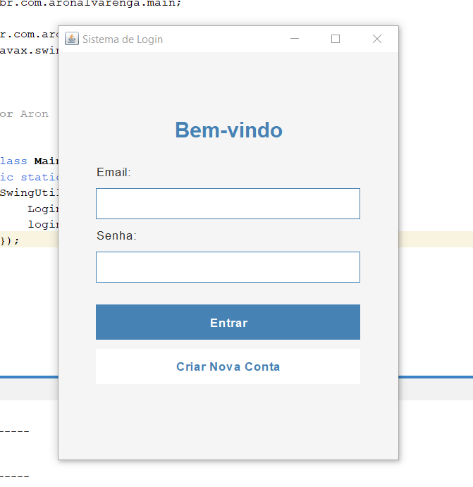
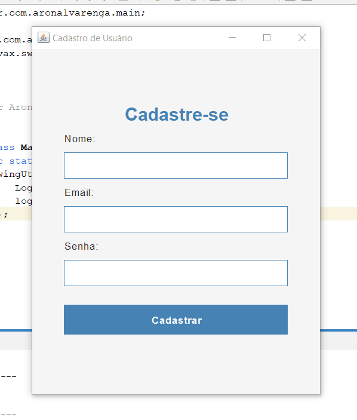
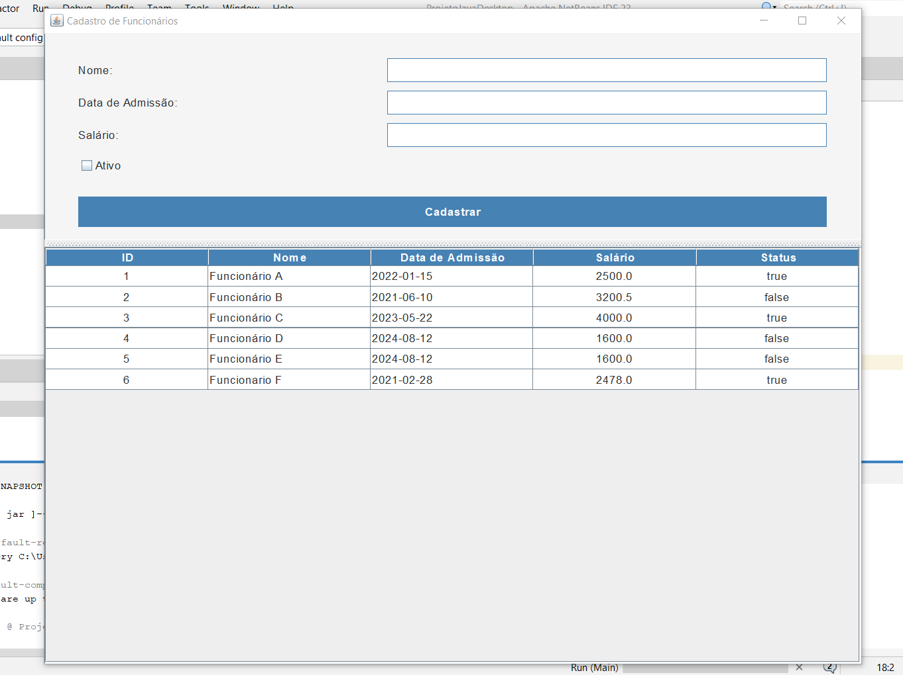

# Projeto Java Desktop com Java Swing e PostgreSQL

## Descrição do Projeto
Aplicação desktop desenvolvida em Java utilizando Swing para a interface gráfica, seguindo o padrão MVC, com backend em PostgreSQL. Possui telas para cadastro e login de usuários, e cadastro de funcionários com exibição em JTable.

## Tecnologias Utilizadas
- Java SE
- Java Swing
- PostgreSQL
- JDBC
- NetBeans IDE

## Requisitos de Sistema
- Java JDK 17 ou superior
- PostgreSQL
- NetBeans IDE

## Instruções de Instalação
1. Crie o banco de dados e execute o script SQL (disponível na pasta `doc`) para criar as tabelas.
2. Atualize as credenciais do banco no arquivo `ConnectionUtil.java`.
3. Importe o projeto no NetBeans e adicione o driver JDBC do PostgreSQL.
4. Compile e execute a aplicação (inicie pela classe `Main`).

## Screenshots

 
  
| Imagem 1 - Tela de Login | Imagem 2 - Tela de Cadastro | Image 3 - Tela de Funcionários |
| :--: | :--: | :--: |
|  |  |  |
  

## Funcionalidades Principais
- Cadastro e login de usuários com senha criptografada (SHA-256).
- Cadastro de funcionários com registro de data, salário e status.
- Exibição dos funcionários em uma JTable.
- Validação de formulários e tratamento de erros.

 
 

 
Feito com ❤️ por <b>Aron Alvarenga</b>

